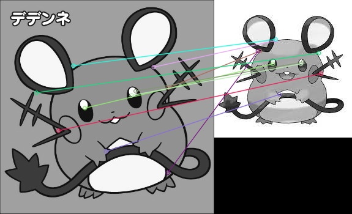

# ORB特徴量を用いた特徴点マッチング
ORB特徴量を用いて特徴点を検出しクエリ画像に対して最も近い辞書画像をマッチングさせタグを返却するスクリプト

## sample



## requirements
```
pip install opencv-python-headless
pip install opencv-contrib-python-headless
pip install numpy
pip install torch
```
